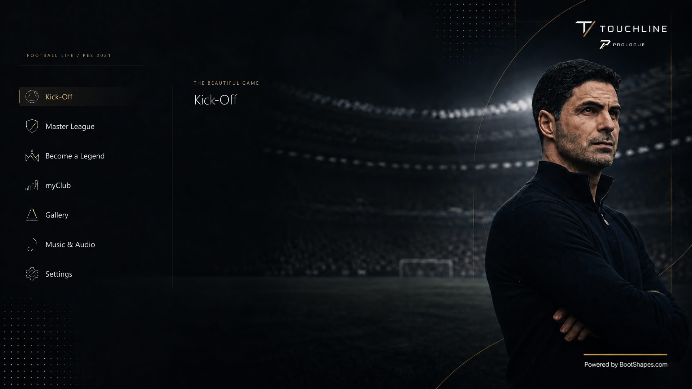
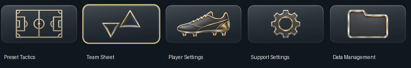
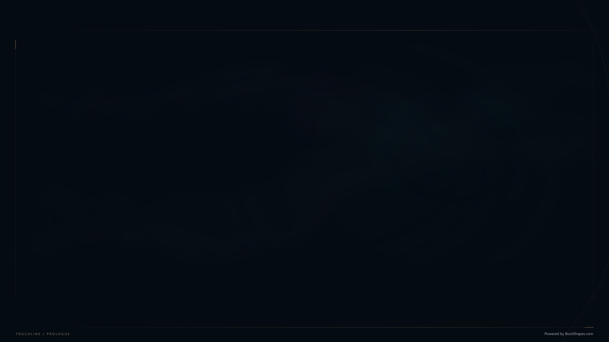

# Touchline Menu

A standalone charcoal, silver and champagne menu mod for **SP Football Life 2026**, with Touchline / Prologue branding, portrait main-menu scenes and quiet `#040B12` information screens. No separate menu pack or UIColors installation is required.

**[Download the latest release](https://askandalus.com/downloads/menu/latest)** · [Installation](#installation) · [Credits](CREDITS.md)



## Included

- Main menu ordered as Kick-off, Master League, Become a Legend, MyClub, Gallery, Music & Audio, Settings.
- Seven portrait scenes and short introductions for Master League and Become a Legend.
- Dark information backgrounds with subtle smoke, fine gold lines and BootShapes branding.
- Silver-and-gold icons for the default Game Plan menu, negotiations, notifications and calendar events.
- Custom loading, saving and controlled-club indicators, plus the Touchline intro movie.
- Readability changes for league/team rows, team ratings and text-entry dialogs.
- The latest working Schedule and text-input files from the author's installation.





## Requirements

- Windows with **SP Football Life 2026** and Sider, with LiveCPK and Lua enabled.
- English game text. This package includes an English string-table override.

All required theme files, fonts, secondary menu assets and the color component are included. Football Life and Sider themselves are not bundled. It uses PES 2021-format assets, but other PES/Football Life versions have not been validated. The FL 2027 wordmark is artwork; the tested game is Football Life 2026.

Touchline and Prologue gameplay/story systems are separate projects. Their names appear in the menu artwork; this download installs the visual theme and intro only.

## Installation

1. Close Football Life and Sider.
2. Download **Touchline-Menu-v1.1.6.zip** from [askandalus.com/downloads/menu](https://askandalus.com/downloads/menu) and extract it completely.
3. Double-click **Install.cmd** and enter the full path to your **SiderAddons** folder, the folder containing `sider.ini`.
4. Start Sider and Football Life again.

Alternatively, from PowerShell in the extracted package:

```powershell
powershell.exe -NoProfile -ExecutionPolicy Bypass -File .\Install.ps1 -SiderDir 'D:\Football Life\SiderAddons'
```

Replace the example path with your installation. Administrator privileges are normally unnecessary if you can write to that folder.

The installer verifies the package, backs up affected files, enables the single `TouchlinePrologue2` LiveCPK root and the bundled `TouchlineMenuColors.lua` component. Its palette is isolated in `content/touchline-menu`.

When upgrading an existing setup, the installer comments out the old MenuC1987, UIColors and TouchlinePrologue roots and the separate `UIColors.lua` module to avoid duplicate menu/palette loading. Their files remain on disk, and uninstall restores the original settings. Other Sider settings, mods and saves are preserved.

Earlier development versions used the same `TouchlinePrologue2` folder. The installer backs them up and removes the obsolete `teamPower.bin` override only when its hash matches a known development copy. An independently edited copy is left for you to resolve.

## Restore the previous setup

Each installation prints its backup directory under `SiderAddons\TouchlineMenu-backups`. Close the game and Sider, then run:

```powershell
powershell.exe -NoProfile -ExecutionPolicy Bypass -File .\Uninstall.ps1 -SiderDir 'D:\Football Life\SiderAddons' -BackupDirectory 'D:\Football Life\SiderAddons\TouchlineMenu-backups\YOUR-BACKUP-FOLDER'
```

This restores overwritten files and settings and removes files created by that installation. It stops if a file has changed since installation, so later edits are not silently lost. Keep the extracted package and backup until you no longer need to restore them.

## Compatibility and troubleshooting

- **No visual changes:** restart both Sider and the game; confirm `TouchlinePrologue2` and `TouchlineMenuColors.lua` are enabled, with LiveCPK and Lua enabled.
- **Schedule or a text-entry screen is blank:** use this complete release, not an older development ZIP. If another mod overrides the same files, check LiveCPK priority. Report the game version and active menu mods with a screenshot.
- **Different icons during a licensed competition:** the premium Game Plan set targets the default menu. Competitions can provide their own menu layouts and icons.
- **Other menu mods:** they can override the same files or runtime colors. Use one default menu theme at a time. The installer backs up existing theme files and settings; it does not merge other menu layouts.
- The intro overrides `movie/intro/FL2026.usm`. Competition-specific intro movies remain controlled by the existing setup.

The assets match the author's reviewed theme in Football Life, including the repaired Schedule and typing dialog. The standalone installer is checked in a clean Sider fixture without external menu packs. The bundled color component is checked against simulated game memory. A full game session with this consolidated release and every competition/mod combination has not been verified.

## Repository and packaging

The repository includes 155 ready-to-install game assets, the bundled color component and its configuration, portable scripts, previews, five high-resolution Game Plan icon masters and the editable information-background SVG. The release ZIP is the easiest download for players. `DEPENDENCY-AUDIT.json` records the sources of the consolidated files.

To verify and package the checked-in release using Python 3:

```text
python tools/package_release.py
```

The ZIP and its SHA-256 checksum are written to `dist/`. No extraction of your game, local credentials or personal save data is required.

See [CREDITS.md](CREDITS.md) for the underlying menu work and tools, and [CHANGELOG.md](CHANGELOG.md) for release notes.
